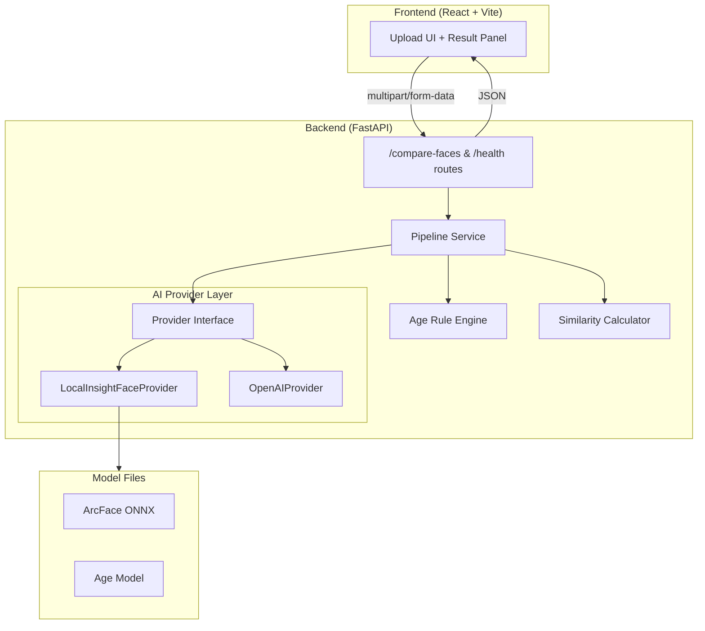
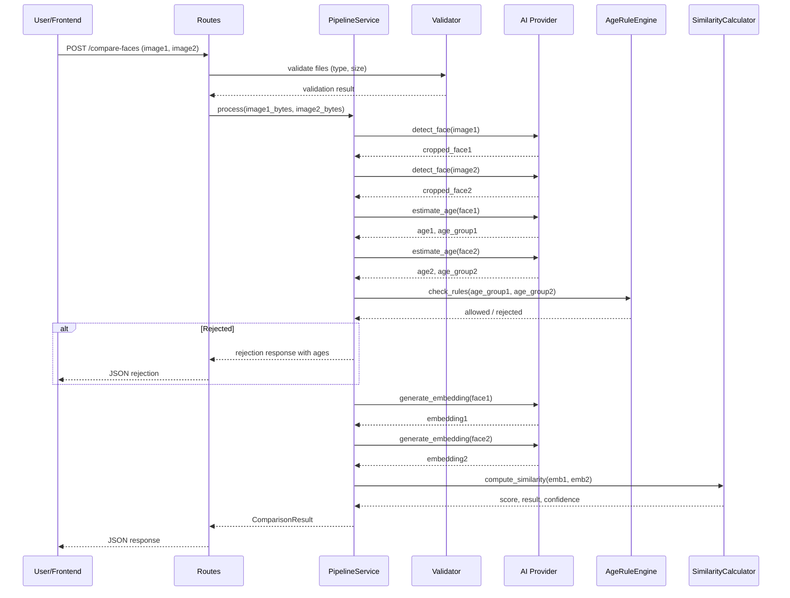

# Design Document: Age-Invariant Face Recognition System

## Overview

The system is a full-stack web application with a Python FastAPI backend and a React + Vite frontend. The backend receives two face images, detects faces, estimates ages, enforces age-based comparison rules, generates ArcFace embeddings, computes cosine similarity, and returns a structured JSON result. An AI provider abstraction allows swapping between local InsightFace inference and an OpenAI-based fallback. The frontend provides a drag-and-drop image upload UI with result visualization.

The architecture prioritizes stateless processing (no image persistence), modular provider design, and containerized deployment.

## Architecture



### Request Flow



## Components and Interfaces

### 1. AI Provider Interface (`ai_providers/base.py`)

```python
from abc import ABC, abstractmethod
from dataclasses import dataclass
import numpy as np

@dataclass
class FaceDetectionResult:
    face_image: np.ndarray  # Cropped face as BGR numpy array
    bbox: tuple[int, int, int, int]  # x1, y1, x2, y2
    confidence: float

@dataclass
class AgeEstimationResult:
    age: int
    age_group: str  # "infant", "child", "teen", "adult", "senior"

class AIProvider(ABC):
    @abstractmethod
    async def detect_face(self, image: np.ndarray) -> FaceDetectionResult:
        """Detect exactly one face. Raises on 0 or >1 faces."""
        ...

    @abstractmethod
    async def estimate_age(self, face_image: np.ndarray) -> AgeEstimationResult:
        """Estimate age from a cropped face image."""
        ...

    @abstractmethod
    async def generate_embedding(self, face_image: np.ndarray) -> np.ndarray:
        """Generate a 512-dim L2-normalized embedding."""
        ...

    @abstractmethod
    async def is_loaded(self) -> bool:
        """Check if models are loaded and ready."""
        ...
```

### 2. LocalInsightFaceProvider (`ai_providers/insightface_provider.py`)

Wraps the `insightface` library. On initialization, loads the RetinaFace detection model and ArcFace recognition model. Uses `insightface.app.FaceAnalysis` which bundles detection, age estimation, and embedding generation.

Key behaviors:
- `detect_face`: Runs `FaceAnalysis.get()`, checks face count, returns cropped face and bbox
- `estimate_age`: Extracts `age` attribute from the InsightFace face object, maps to age group
- `generate_embedding`: Extracts `embedding` attribute, applies L2 normalization
- Falls back to MTCNN (via `facenet-pytorch`) if RetinaFace returns no faces

### 3. OpenAIProvider (`ai_providers/openai_provider.py`)

Uses OpenAI's vision API for age estimation and identity similarity. Since OpenAI cannot produce numeric embeddings, this provider:
- `detect_face`: Uses a local lightweight face detector (OpenCV Haar cascade) for cropping
- `estimate_age`: Sends face image to GPT-4.1-mini with a prompt requesting age estimation
- `generate_embedding`: Not supported directly; instead uses a vision prompt to estimate similarity between two faces, returning a synthetic similarity score
- `is_loaded`: Checks that `OPENAI_API_KEY` is set

### 4. Age Rule Engine (`services/age_rules.py`)

```python
def check_age_rules(age_group1: str, age_group2: str) -> tuple[bool, str | None]:
    """
    Returns (allowed, rejection_message).
    allowed=True means comparison can proceed.
    """
```

Rule matrix (symmetric):

| Group 1 \ Group 2 | infant | child | teen | adult | senior |
|---|---|---|---|---|---|
| infant | ✅ | ✅ | ❌ | ❌ | ❌ |
| child | ✅ | ✅ | ✅ | ✅ | ✅ |
| teen | ❌ | ✅ | ✅ | ✅ | ✅ |
| adult | ❌ | ✅ | ✅ | ✅ | ✅ |
| senior | ❌ | ✅ | ✅ | ✅ | ✅ |

The only rejections are: infant paired with teen, adult, or senior.

### 5. Similarity Calculator (`services/similarity.py`)

```python
def compute_similarity(embedding1: np.ndarray, embedding2: np.ndarray) -> tuple[float, str, float]:
    """
    Returns (similarity_score, result_label, confidence).
    result_label: "same_person" or "different_person"
    confidence: derived from distance to threshold
    """
```

- Cosine similarity: `dot(e1, e2) / (norm(e1) * norm(e2))`
- Since embeddings are L2-normalized, this simplifies to `dot(e1, e2)`
- Threshold: 0.35
- Confidence: `min(abs(similarity - 0.35) / 0.65, 1.0)` — distance from threshold normalized to [0, 1]

### 6. Pipeline Service (`services/pipeline.py`)

Orchestrates the full comparison flow:
1. Detect face in each image
2. Estimate age for each face
3. Check age rules
4. If allowed, generate embeddings and compute similarity
5. Assemble and return the result

### 7. Routes (`routes/compare.py`, `routes/health.py`)

- `POST /compare-faces`: Accepts `UploadFile` fields, validates, delegates to pipeline, returns JSON
- `GET /health`: Returns `{"status": "ok", "model_loaded": bool}`

### 8. File Validator (`utils/validator.py`)

```python
ALLOWED_EXTENSIONS = {"jpg", "jpeg", "png", "webp"}
MAX_FILE_SIZE = 10 * 1024 * 1024  # 10 MB

def validate_upload(file: UploadFile) -> bytes:
    """Validate file type and size, return bytes. Raises HTTPException on failure."""
```

### 9. Frontend (`frontend/`)

React + Vite SPA with:
- Two `ImageUploader` components (drag-and-drop + click)
- A `CompareButton` component (disabled until both images selected)
- A `ResultPanel` component showing ages, similarity, confidence, result
- Client-side validation for file type and size before upload
- Loading spinner during API call

## Data Models

### Pydantic Response Models (`models/schemas.py`)

```python
from pydantic import BaseModel

class ComparisonResponse(BaseModel):
    age1: int
    age2: int
    age_group1: str
    age_group2: str
    similarity_score: float
    confidence: float
    result: str  # "same_person" or "different_person"
    message: str

class RejectionResponse(BaseModel):
    age1: int
    age2: int
    age_group1: str
    age_group2: str
    result: str  # "rejected"
    message: str

class ErrorResponse(BaseModel):
    error: str

class HealthResponse(BaseModel):
    status: str  # "ok"
    model_loaded: bool
```

### Internal Data Structures

```python
@dataclass
class FaceAnalysisResult:
    face_image: np.ndarray
    age: int
    age_group: str
    embedding: np.ndarray  # 512-dim, L2-normalized

@dataclass
class PipelineResult:
    age1: int
    age2: int
    age_group1: str
    age_group2: str
    similarity_score: float | None  # None if rejected
    confidence: float | None
    result: str  # "same_person", "different_person", "rejected"
    message: str
```

### Age Group Mapping

```python
def classify_age_group(age: int) -> str:
    if age <= 4:
        return "infant"
    elif age <= 12:
        return "child"
    elif age <= 19:
        return "teen"
    elif age <= 49:
        return "adult"
    else:
        return "senior"
```


## Correctness Properties

*A property is a characteristic or behavior that should hold true across all valid executions of a system — essentially, a formal statement about what the system should do. Properties serve as the bridge between human-readable specifications and machine-verifiable correctness guarantees.*

### Property 1: File format validation

*For any* file with an extension not in {jpg, jpeg, png, webp}, the validator SHALL reject it; *for any* file with an extension in {jpg, jpeg, png, webp}, the validator SHALL NOT reject it for format reasons.

**Validates: Requirements 1.2**

### Property 2: File size validation

*For any* file with size greater than 10 MB, the validator SHALL reject it; *for any* file with size less than or equal to 10 MB, the validator SHALL NOT reject it for size reasons.

**Validates: Requirements 1.3**

### Property 3: Age group classification correctness

*For any* non-negative integer age, `classify_age_group(age)` SHALL return exactly one of the five groups, and the returned group SHALL match the defined ranges: 0–4 → "infant", 5–12 → "child", 13–19 → "teen", 20–49 → "adult", 50+ → "senior". Edge cases: boundary values 0, 5, 13, 20, 50 SHALL map to the group whose range starts at that value.

**Validates: Requirements 3.2, 3.3**

### Property 4: Age rule engine — infant rejection

*For any* pair of age groups where one is "infant" and the other is "teen", "adult", or "senior", `check_age_rules` SHALL return rejected with the message "Cannot reliably compare infant/childhood images with adult images".

**Validates: Requirements 4.2**

### Property 5: Age rule engine — non-infant allowance

*For any* pair of age groups where neither is "infant", `check_age_rules` SHALL return allowed.

**Validates: Requirements 4.4**

### Property 6: L2 normalization invariant

*For any* non-zero 512-dimensional vector, after L2 normalization the resulting vector's L2 norm SHALL equal 1.0 within a tolerance of 1e-6.

**Validates: Requirements 5.2, 5.3**

### Property 7: Cosine similarity range for unit vectors

*For any* two L2-normalized 512-dimensional vectors, the cosine similarity SHALL be a value in the range [-1.0, 1.0].

**Validates: Requirements 6.1**

### Property 8: Threshold classification consistency

*For any* similarity score, the classification SHALL be "same_person" if and only if the score is greater than or equal to 0.35, and "different_person" otherwise.

**Validates: Requirements 6.2, 6.3**

### Property 9: Successful comparison response completeness

*For any* successful comparison result, the JSON response SHALL contain all required fields: age1, age2, age_group1, age_group2, similarity_score, confidence, result, and message, with correct types.

**Validates: Requirements 7.1**

### Property 10: Compare button enabled state

*For any* frontend state, the "Compare" button SHALL be enabled if and only if both image slots have a selected file.

**Validates: Requirements 10.2**

### Property 11: Frontend client-side file validation

*For any* file selected in the frontend, if the file type is not in {image/jpeg, image/png, image/webp} or the file size exceeds 10 MB, the frontend SHALL display a validation error and prevent submission.

**Validates: Requirements 10.6**

### Property 12: Age rule symmetry

*For any* two age groups g1 and g2, `check_age_rules(g1, g2)` SHALL return the same result as `check_age_rules(g2, g1)`.

**Validates: Requirements 4.1, 4.2, 4.3, 4.4**

## Error Handling

### Backend Error Categories

| Error Condition | HTTP Status | Error Message |
|---|---|---|
| Unsupported file format | 400 | "Unsupported file format: {ext}. Allowed: jpg, jpeg, png, webp" |
| File too large | 400 | "File size exceeds 10 MB limit" |
| No face detected | 422 | "No face detected in the image" |
| Multiple faces detected | 422 | "Multiple faces detected; please upload an image with exactly one face" |
| Age rule rejection | 200 | "Cannot reliably compare infant/childhood images with adult images" (returned as a rejection result, not an error) |
| Model not loaded | 503 | "AI models are not loaded. Please try again later." |
| Invalid image data | 400 | "Could not decode image. Please upload a valid image file." |
| OpenAI API failure | 502 | "External AI provider error. Falling back or retrying." |

### Error Handling Strategy

- All exceptions in the pipeline are caught and converted to structured JSON error responses
- Face detection and age estimation errors are specific and actionable
- Age rule rejections are NOT errors — they return HTTP 200 with a rejection result containing age data
- File validation errors are returned before any AI processing begins
- Provider fallback: if OpenAI fails, log warning and attempt LocalInsightFace if available

### Frontend Error Handling

- Client-side validation errors shown inline next to the upload area
- API errors displayed in the result panel with the error message
- Network errors shown with a generic "Connection error. Please try again." message
- Loading state cleared on both success and error

## Testing Strategy

### Testing Framework

- **Backend**: pytest with `pytest-asyncio` for async tests
- **Property-based testing**: Hypothesis (Python) for backend properties
- **Frontend**: Vitest with React Testing Library
- **Frontend property testing**: fast-check for JavaScript property tests

### Unit Tests

Unit tests cover specific examples, edge cases, and error conditions:

- File validator: test specific valid/invalid files, boundary sizes
- Age group classifier: test each boundary value (0, 4, 5, 12, 13, 19, 20, 49, 50)
- Age rule engine: test each cell in the rule matrix
- Similarity calculator: test known embedding pairs with expected scores
- Response models: test serialization of each response type
- Frontend components: test render states, button states, error display

### Property-Based Tests

Each correctness property maps to a property-based test with minimum 100 iterations:

| Property | Test Library | Generator Strategy |
|---|---|---|
| Property 1: File format validation | Hypothesis | `st.text()` for extensions, filtered against allowed set |
| Property 2: File size validation | Hypothesis | `st.integers(min_value=0, max_value=20*1024*1024)` for sizes |
| Property 3: Age group classification | Hypothesis | `st.integers(min_value=0, max_value=120)` for ages |
| Property 4: Infant rejection | Hypothesis | `st.sampled_from(["teen", "adult", "senior"])` for second group |
| Property 5: Non-infant allowance | Hypothesis | `st.sampled_from(["child", "teen", "adult", "senior"])` for both groups |
| Property 6: L2 normalization | Hypothesis + NumPy | `arrays(np.float64, (512,))` filtered non-zero |
| Property 7: Cosine similarity range | Hypothesis + NumPy | Two random unit vectors of dimension 512 |
| Property 8: Threshold classification | Hypothesis | `st.floats(min_value=-1.0, max_value=1.0)` |
| Property 9: Response completeness | Hypothesis | Random valid ComparisonResponse instances |
| Property 10: Compare button state | fast-check | `fc.record({image1: fc.option(...), image2: fc.option(...)})` |
| Property 11: Client-side validation | fast-check | Random file objects with various types and sizes |
| Property 12: Age rule symmetry | Hypothesis | `st.sampled_from(age_groups)` for both groups |

### Test Tagging Convention

Each property test must include a comment referencing its design property:

```python
# Feature: age-invariant-face-recognition, Property 3: Age group classification correctness
@given(age=st.integers(min_value=0, max_value=120))
def test_age_group_classification(age):
    ...
```

### Test Organization

```
backend/
  tests/
    test_validator.py          # Properties 1, 2 + unit tests
    test_age_classifier.py     # Property 3 + edge case unit tests
    test_age_rules.py          # Properties 4, 5, 12 + unit tests
    test_similarity.py         # Properties 7, 8 + unit tests
    test_embedding.py          # Property 6 + unit tests
    test_pipeline.py           # Property 9 + integration tests
    test_routes.py             # API endpoint tests
frontend/
  src/
    __tests__/
      CompareButton.test.tsx   # Property 10
      FileValidation.test.tsx  # Property 11
      ResultPanel.test.tsx     # Unit tests
```
